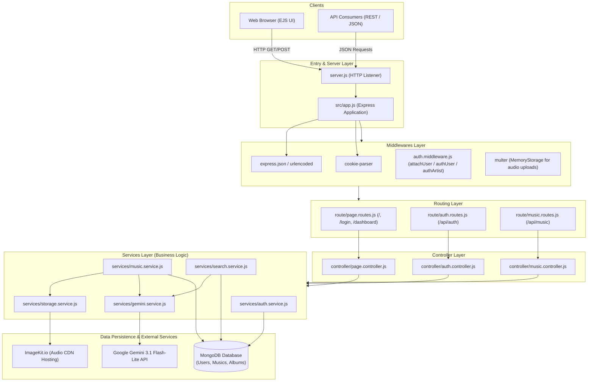
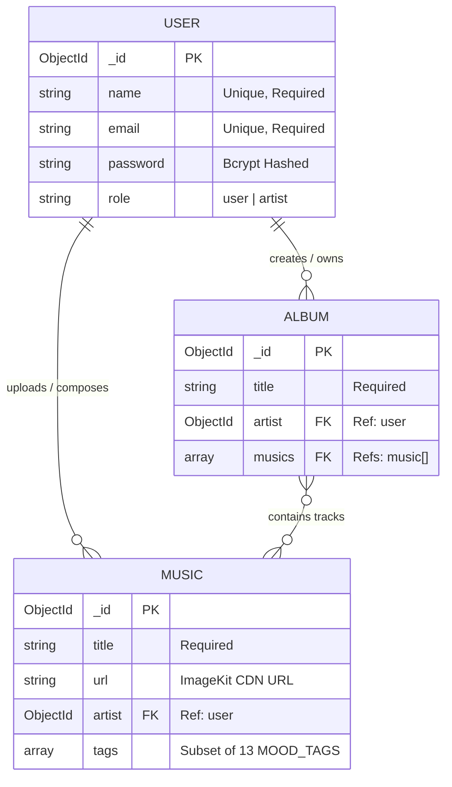
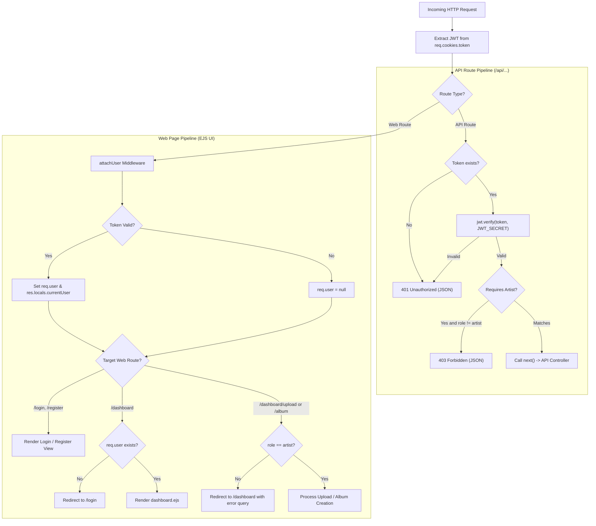
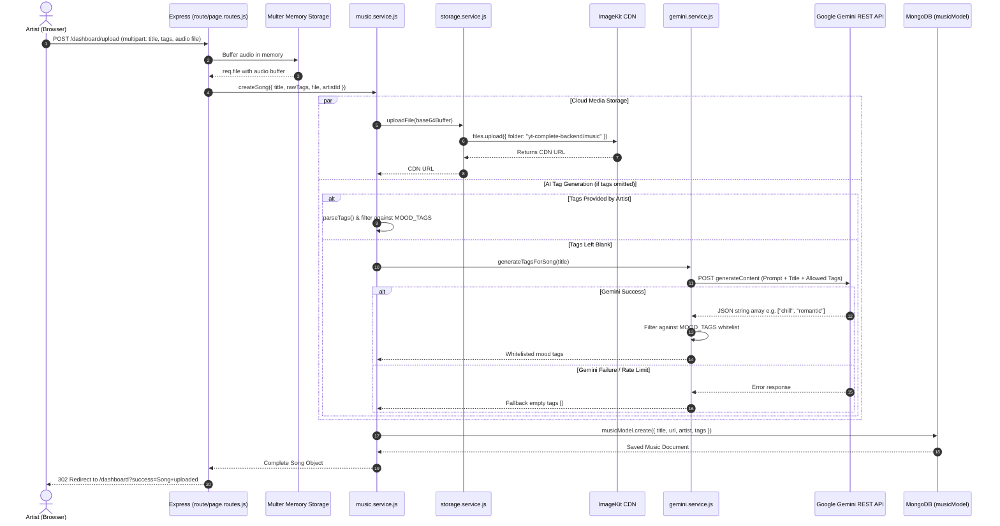
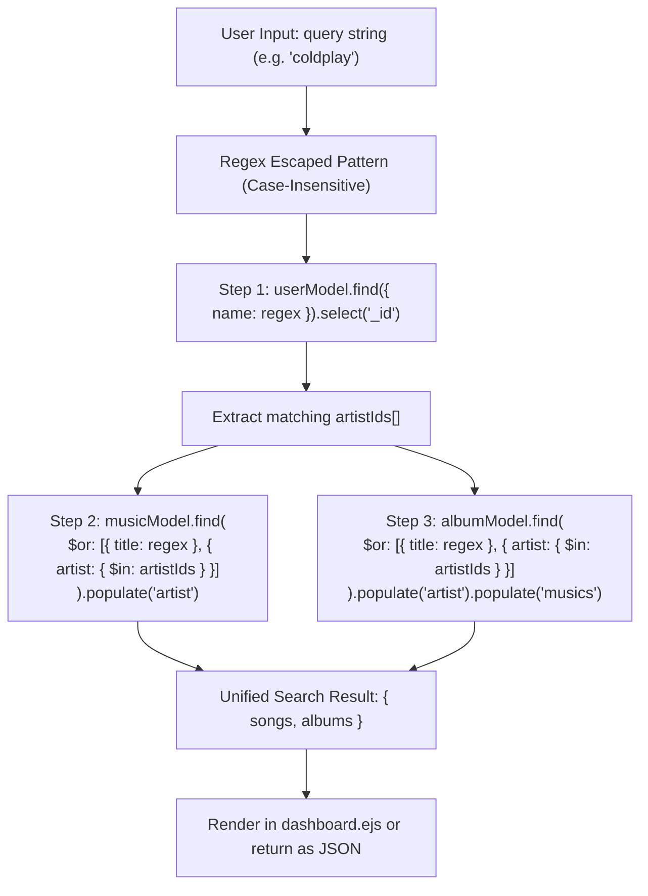
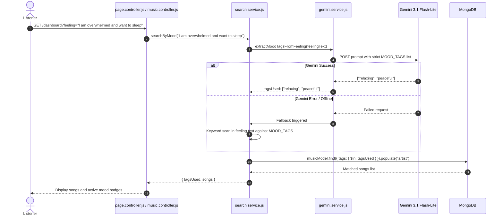
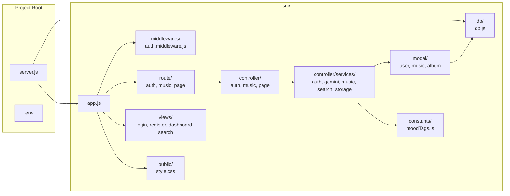

# 🏛️ MoodSwings System Architecture

This document provides a comprehensive technical architecture overview of **MoodSwings**, illustrated using Mermaid diagrams.

---

## 1. High-Level System Architecture

MoodSwings follows a modular Layered MVC (Model-View-Controller) architecture with a dedicated **Services Layer** isolating third-party integrations (Google Gemini AI, ImageKit) and business logic from transport controllers.

---

## 2. Entity-Relationship (ER) Diagram

The data model uses Mongoose schemas with relational referencing between users (artists), individual music tracks, and curated albums.

---

## 3. Authentication & Dual-Tier Middleware Architecture

The application handles both server-rendered UI requests (which need browser redirects upon auth failure) and headless API requests (which require JSON status codes `401`/`403`).

---

## 4. Track Upload & AI Auto-Tagging Flow

When an artist uploads a track, tags can either be supplied manually or derived through **Gemini 3.1 Flash-Lite** against the controlled 13-tag vocabulary.

---

## 5. Search Engine Architecture

MoodSwings provides two distinct search mechanisms handled by [`search.service.js`](file:///Users/dhirendrakumaryadav/vscode/Node/MOODSWINGS/src/controller/services/search.service.js):

### A. Unified Text Search Data Flow

Searches songs and albums simultaneously by title or matching artist name in a single pass.

### B. Natural Language Mood Search Sequence

Translates subjective emotional text into structured database queries.

---

## 6. Directory and Component Map

